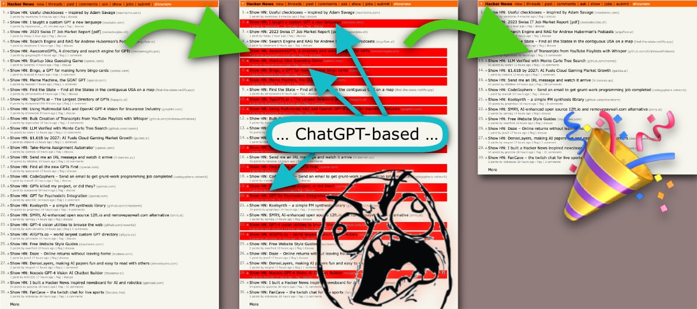

# HN-NO-GPT-BS

Chrome Extension for freeing HN from tiresome OpenAI/ChatGPT clutter.

**Problem**: Parts of HN (like [“shownew”](https://news.ycombinator.com/shownew)) are unusable these days due to the tiresome OpenAI/ChatGPT-related clutter.

**Solution**: Hide these submissions. (Exception: if they exceed a certain popularity threshold of 10 comments or 10 points.)

## Install

1. Grab a copy of this repo by cloning or downloading.
2. Open [extension dashboard](chrome://extensions) in Chrome.
3. Enable “Developer mode” toggle in the top left corner.
4. Drag&Drop the entire folder of this repo onto the dashboard page.

You can also customise the logic in [`script.js`](script.js). (Don’t forget to reload the extension afterwards; there is a little “refresh” icon for that on the extension dashboard.)

## License

[Public Domain](LICENSE.txt).
